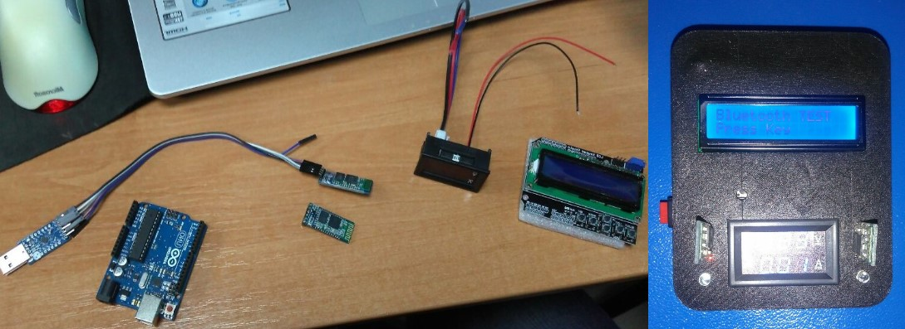

### Abstract

The laboratory stand being developed is designed to demonstrate data transmission using Bluetooth technology and conduct practical lab work for students to explore the Bluetooth wireless interface. During the lab work, students will learn the operating principles of Bluetooth transceivers, module control commands, Master and Slave modes, and the operation of a Bluetooth adapter in different modes in conjunction with a microcontroller.

### [►](https://youtube.com/shorts/mk-yPnf5z40?feature=share)

<!--   -->

